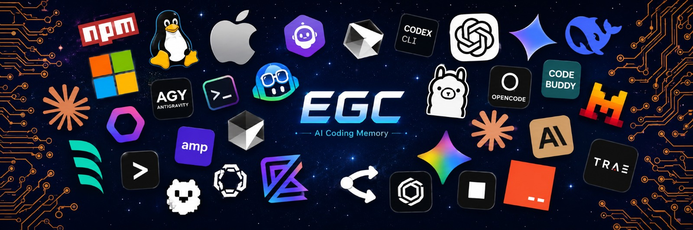
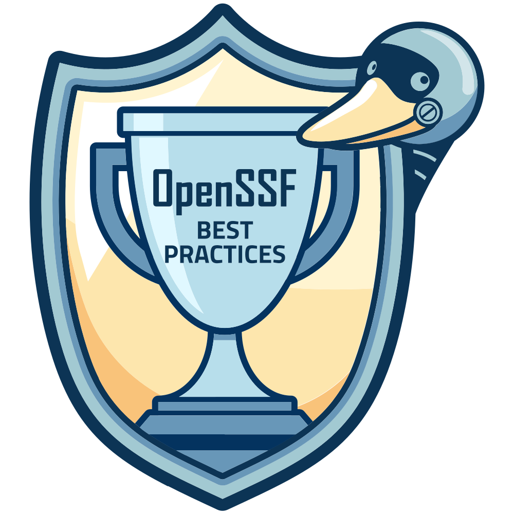

<!-- LANGUAGE-SELECTOR-START -->
🌐 [English](../../README.md) · [العربية](../ar/README.md) · **Deutsch** · [Español](../es/README.md) · [Français](../fr/README.md) · [हिन्दी](../hi/README.md) · [Italiano](../it/README.md) · [日本語](../ja/README.md) · [한국어](../ko/README.md) · [Português (Brasil)](../pt/README.md) · [Русский](../ru/README.md) · [简体中文](../zh-CN/README.md)
<!-- LANGUAGE-SELECTOR-END -->

<div align="center">

</div>

<div align="center">

# EGC - Gib jedem KI-Agenten dasselbe Gehirn

**Persistenter Speicher, den jeder KI-Agent, jede IDE, jedes Terminal und jede Session automatisch teilt. Keine Prompts zum Auswendiglernen. Kein Kontext zum Wiederaufbauen. Einfach sprechen.**

</div>

---

EGC ist nicht bloß ein weiteres Speicher-Tool. Es ist die Intelligenzschicht, die jede KI so arbeiten lässt, als wäre sie vom ersten Tag an in deinem Projekt dabei gewesen: in Cursor, Copilot, Claude Code, Codex, Aider und jedem Terminal-Agenten (insgesamt 20 KI-Coding-Tools). Funktioniert nativ mit Claude, GPT-4o, Gemini, DeepSeek, Mistral, Groq, Cohere und Vertex AI, plus OpenRouter für Qwen3, Llama 4 und mehr.

Jedes Gespräch baut die kollektive Intelligenz deines Projekts auf. Jeder Agent erbt sie. Jede Session wird intelligenter.

---

## Installation

```bash
npm install -g @egchq/egc && egc install
```

- **Reduziere Kontext-Verschwendung um bis zu 90 %, senke Token-Kosten und halte jede KI über Sessions hinweg perfekt synchronisiert.**
- **Guardian: Validiere jeden Befehl vor der Ausführung, blockiere gefährliche Schreibzugriffe und erkenne Prompt-Injection. Jedes geteilte Gehirn wird mit einer integrierten Sicherheitsschicht geliefert.**
- **Ein Befehl, null Konfiguration: Der Speicher bleibt lokal sowie verschlüsselt auf deinem Rechner und wird niemals in Git committed.**

<div align="center">
  
</div>

[Vollständige Installationsanleitung](../../docs/installation.md)

---

## Im Inneren des Gehirns: Wie EGC funktioniert

EGC ist keine bloße Liste von Tools; es ist ein einzelnes Gehirn mit mehreren Fähigkeiten. Es erinnert sich, versteht, schützt, filtert und koordiniert über jeden KI-Agenten auf deinem Rechner hinweg.

<div align="center">
  
</div>

### Keine Befehle auswendig lernen, einfach natürlich sprechen

Sprich in jeder beliebigen Sprache mit dem Gehirn: "Speichere diese Session", "Was haben wir bezüglich Auth entschieden?", "Merke dir diese Entscheidung". EGC versteht die Absicht, speichert den Kontext und ruft ihn sofort in jedem anderen Tab, Terminal oder Tool auf deinem Rechner ab. Ein Gehirn. Jeder Agent. Null Befehle zum Auswendiglernen.

### Persistenter Projekt-Speicher

EGC verleiht jedem KI-Agenten ein persistentes, geteiltes Gehirn. Es erfasst Entscheidungen, Session-Kontext, Arbeitsspeicher sowie gelernte Muster und stellt diese sofort in jedem anderen Terminal, in jeder IDE oder in jedem neu geöffneten Agenten zur Verfügung. Session-Status, Projektverlauf und gesammelte Lektionen fließen nahtlos zwischen Tabs, Tools und Teammitgliedern: keine manuelle Synchronisation, kein Kontextverlust. Der gesamte Speicher liegt in `~/.egc` auf deinem Rechner, verschlüsselt mit AES-256-GCM, getrennt nach Projekt-Branch, und wird niemals in dein Repository committed.

### Guardian: Integrierte Sicherheits-Schutzplanken

Die zweite Hälfte des Gehirns führt Sicherheits-Schutzplanken im Hintergrund aus. Sie validiert Befehle vor ihrer Ausführung, blockiert risikoreiche Schreibzugriffe, komprimiert den Kontext, bevor er überläuft, orchestriert mehrstufige Aufgaben über Agenten hinweg und lernt aus jeder Korrektur, ganz ohne dass du ein einziges Tool aufrufen musst. Ein unsichtbares Sicherheitsnetz, das den Kontext schlank, Aktionen sicher und Workflows autonom hält.

### Token Crusher: Das Gehirn filtert Rauschen, bevor es speichert

Das Gehirn erinnert sich nicht nur: Es filtert. Bevor eine Shell-Ausgabe das Modell erreicht, komprimiert der Token Crusher von EGC Git-Logs, Test-Spam, Installations-Rauschen und riesige JSONs um bis zu 90 %, wobei jeder Fehler und jede Warnung erhalten bleibt. Frage einfach in einer beliebigen Sprache "Wie viel habe ich gespart?", und die Antwort kommt direkt aus deinem lokalen Ledger ohne jegliche Kosten: günstigere Sessions, länger anhaltender Kontext.

---

## Prompt-Bibliothek

Als Bonus gewährt EGC dir Zugriff auf 63 Agenten, 230 Skills und 77 Befehle sowie 111 Regeln: Spezialisten, die deinen Code eigenständig überprüfen, Best-Practice-Leitfäden für jede Sprache und Situation, Shortcuts, die eine ganze Reihe von Aufgaben für dich ausführen, und Stilregeln, die deinen Code konsistent halten. Alles geschrieben aus realen Engineering-Sessions, nicht aus der Theorie. Du möchtest nichts davon nutzen? Kein Problem: Der permanente Speicher von EGC funktioniert genauso.

---

## Schnellstart

Es gibt keinen zweiten Schritt. Öffne ein beliebiges deiner KI-Tools und sprich einfach los: "Hallo", "Lass uns weitermachen", "Merke dir diese Entscheidung", in jeder Sprache. Sessions verbinden sich sofort, der Speicher lädt automatisch und jeder offene Tab weiß bereits, was die anderen tun: Zwei Cursor-Tabs, ein Claude Code Terminal und eine Antigravity-Session teilen sich alle gleichzeitig denselben lebendigen Kontext.

Ein Live-Dashboard, das Agenten-Aktivitäten, Tokens und Kosten anzeigt, startet direkt nach der Installation automatisch. Bevorzugst du manuelle Kontrolle? Jeder Befehl ist in der [Installationsanleitung](../../docs/installation.md) dokumentiert: Wahrscheinlich wirst du nie einen eingeben müssen.

---

🌐 [English](../../README.md) · [العربية](../ar/README.md) · **Deutsch** · [Español](../es/README.md) · [Français](../fr/README.md) · [हिन्दी](../hi/README.md) · [Italiano](../it/README.md) · [日本語](../ja/README.md) · [한국어](../ko/README.md) · [Português (Brasil)](../pt/README.md) · [Русский](../ru/README.md) · [简体中文](../zh-CN/README.md)

---

## EGC unterstützen

EGC wird von einem einzelnen Entwickler gebaut, öffentlich gepflegt und ist kostenlos.

- **[Website](https://fmarzochi.github.io/EGCSite)**: Vollständige Dokumentation, Funktionsübersicht und Live-Demo
- **[Discord beitreten](https://discord.gg/TxppsGb52)**: Fragen stellen, Feedback teilen
- **[Sponsor auf GitHub werden](https://github.com/sponsors/Fmarzochi)**: Jeder Betrag hilft
- **[Spenden über PayPal](https://www.paypal.com/donate/?business=fmarzochi%40gmail.com&currency_code=USD)**: Kein GitHub-Konto erforderlich
- **Gib dem Repository einen Stern**: Hilft anderen Entwicklern, es zu finden
- **[Mitwirken](../../.github/CONTRIBUTING.md)**: Agenten, Skills, Befehle, Bugfixes, Dokumentation
- **Teilen**: Wenn EGC deine Arbeitsweise verändert hat, erzähle es weiter

### Sponsoren

Die Unterstützung aus der Community hält dieses Projekt am Leben und unabhängig.

#### Tool-Partner

KI-Coding-Tools, die sich nativ mit EGC integrieren. Partner erhalten Logo-Platzierungen auf allen READMEs und auf EGCSite.

<a href="https://www.pincushion.io/"></a>

#### Jährliche Sponsoren · _Sei der erste jährliche Sponsor._

---

#### Unterstützer

<a href="https://github.com/chizormaangel-commits"></a>

#### Monatliche Sponsoren · _sei der Erste_

---

<div align="center">

[](https://www.bestpractices.dev/projects/13099) [](https://www.bestpractices.dev/projects/13099?level=baseline-1) [](https://www.bestpractices.dev/projects/13099?level=baseline-2) [](https://www.bestpractices.dev/projects/13099?level=baseline-3)

<br>

<a href="https://bestpractices.dev/projects/13099"></a>
&emsp;&emsp;&emsp;&emsp;&emsp;&emsp;&emsp;
<a href="https://www.linkedin.com/in/felipemarzochi"></a>

</div>
