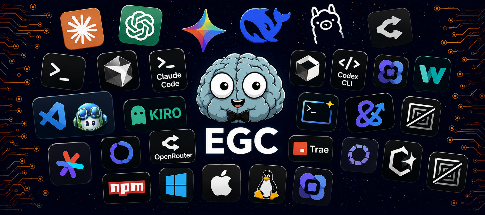
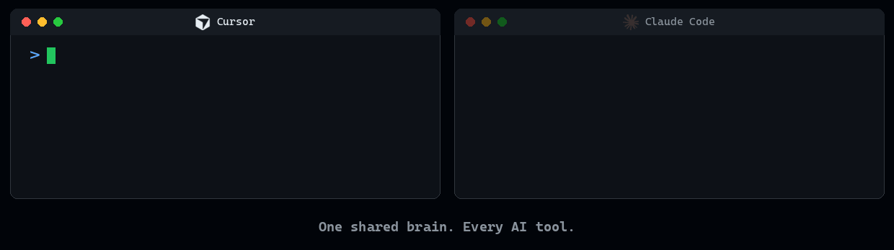

<!-- LANGUAGE-SELECTOR-START -->
🌐 [English](../../README.md) · [العربية](../ar/README.md) · [Español](../es/README.md) · [हिन्दी](../hi/README.md) · [日本語](../ja/README.md) · [한국어](../ko/README.md) · [Português (Brasil)](../pt/README.md) · [Русский](../ru/README.md) · **简体中文**
<!-- LANGUAGE-SELECTOR-END -->

<div align="center">

</div>


<div align="center">

# EGC - 给每个 AI 智能体同一个大脑

**每个 AI 智能体、IDE、终端和会话自动共享的持久化记忆。无需记忆提示词,无需重建上下文,开口即可。**

</div>

---

EGC 不是又一个记忆工具。它是一个智能层,让任何 AI 都像从第一天起就参与你的项目一样工作,无论是在 Cursor、Copilot、Claude Code、Codex、Aider 还是任何终端智能体中(共支持 20 个 AI 编程工具)。原生支持 Claude、GPT-4o、Gemini、DeepSeek、Mistral、Groq、Cohere 和 Vertex AI,并通过 OpenRouter 支持 Qwen3、Llama 4 等更多模型。

每一次对话都在积累项目的集体智慧。每个智能体都能继承,每个会话都更聪明。

---

## 安装

```bash
npm install -g @egchq/egc && egc install
```

- **将上下文浪费减少高达 90%,降低 token 成本,让所有 AI 在会话之间保持完美对齐。**
- **Guardian:在执行前校验每条命令,拦截危险写入,检测提示词注入。每个共享大脑都自带内置安全层。**
- **一条命令,零配置:记忆保存在你的本地机器上并加密,永远不会提交到 git。**

<div align="center">
  
</div>

[完整安装指南](../../docs/installation.md)

---

## 大脑内部:EGC 如何工作

EGC 不是工具清单,而是一个具备多种能力的大脑。它会记忆、理解、守护、过滤和协调,覆盖你机器上的每个 AI 智能体。

<div align="center">
  
</div>

### 无需记忆命令,自然对话即可

用任何语言与大脑对话:「保存这个会话」「关于鉴权我们决定了什么?」「记住这个决定」。EGC 理解意图,存储上下文,并在你机器上的任何其他标签页、终端或工具中即时调出。一个大脑,所有智能体,零命令记忆负担。

### 持久化项目记忆

EGC 为每个 AI 智能体提供一个持久化的共享大脑。它捕捉决策、会话上下文、工作记忆和习得模式,并让它们在你打开的任何其他终端、IDE 或智能体中即时可用。会话状态、项目历史和积累的经验在标签页、工具和队友之间无缝流动:无需手动同步,上下文零丢失。所有记忆都保存在你机器的 `~/.egc` 中,使用 AES-256-GCM 加密,按项目分支独立存储,永远不会提交到你的仓库。

### Guardian:内置安全护栏

大脑的另一半在后台运行安全护栏。它在命令执行前进行校验,拦截高风险写入,在上下文溢出前进行压缩,在智能体之间编排多步任务,并从每次纠正中学习,而你无需调用任何工具。这是一张隐形的安全网,让上下文保持精简、操作保持安全、工作流保持自主。

### Token Crusher:大脑在记忆之前先过滤噪音

大脑不只是记忆,它还会过滤。在任何 shell 输出到达模型之前,EGC 的 Token Crusher 会将 git 日志、测试噪音、安装刷屏和巨型 JSON 压缩高达 90%,并始终保留每一条错误和警告。运行 `egc saved` 即可查看在本地零成本计算的累计 token 节省:更便宜的会话,更持久的上下文。

---

## 提示词库

作为附赠,EGC 为你提供 63 个智能体、230 个技能和 77 个命令,外加 111 条规则:能独立审查代码的专家、覆盖每种语言和场景的最佳实践指南、一键执行整套任务的快捷指令,以及保持代码风格一致的规则。全部来自真实工程会话的沉淀,而非纸上谈兵。不想用这些?没关系:EGC 的持久化记忆照常工作。

---

## 快速开始

运行一次 `egc watch`,然后忘掉它的存在:

```bash
egc watch
```

在 Cursor 中变更上下文,它会自动出现在 Gemini CLI、Copilot、Windsurf、Zed 或任何终端智能体中。无需手动操作,状态永不过期。

要在浏览器中实时查看智能体的工具调用、token 和成本:

```bash
egc dashboard
```

---

🌐 [English](../../README.md) · [العربية](../ar/README.md) · [Español](../es/README.md) · [हिन्दी](../hi/README.md) · [日本語](../ja/README.md) · [한국어](../ko/README.md) · [Português (Brasil)](../pt/README.md) · [Русский](../ru/README.md) · **简体中文**

---

## 支持 EGC

EGC 是一个由社区成员独立开发并公开维护的开源免费项目。

- **[官网](https://fmarzochi.github.io/EGCSite)**：包含完整文档、功能概览与在线演示
- **[加入 Discord](https://discord.gg/AtazrtxJ)**：在这里提问并分享您的反馈意见
- **[在 GitHub 上支持本项目](https://github.com/sponsors/Fmarzochi)**：金额不限，每一份支持都很重要
- **[通过 PayPal 捐赠](https://www.paypal.com/donate/?business=fmarzochi%40gmail.com&currency_code=USD)**：无需 GitHub 账号
- **点个 Star 关注**：让更多开发者发现此项目
- **[参与贡献](../../.github/CONTRIBUTING.md)**：开发 Agent、技能、命令、修复 Bug 以及完善文档
- **分享**：如果 EGC 改变了你的工作方式，欢迎向他人推荐

### 赞助者

社区的支持是维持本项目生命力与独立性的基石。

#### 工具合作伙伴

与 EGC 原生集成的 AI 辅助编程工具。合作伙伴的 Logo 将会在所有项目的 README 文档和 EGCSite 官网上集中展示。

<a href="https://www.pincushion.io/"></a>

#### 年度赞助 · _虚位以待，期待首个年度赞助。_

---

#### 支持者

<a href="https://github.com/chizormaangel-commits"></a>

#### 月度赞助者 · _虚位以待_

---

<div align="center">

[](https://www.bestpractices.dev/projects/13099) [](https://www.bestpractices.dev/projects/13099?level=baseline-1) [](https://www.bestpractices.dev/projects/13099?level=baseline-2) [](https://www.bestpractices.dev/projects/13099?level=baseline-3)

<br>

<a href="https://bestpractices.dev/projects/13099"></a>
&emsp;&emsp;&emsp;&emsp;&emsp;&emsp;&emsp;
<a href="https://www.linkedin.com/in/felipemarzochi"></a>

</div>
