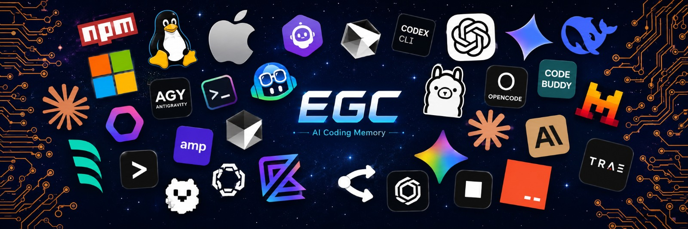
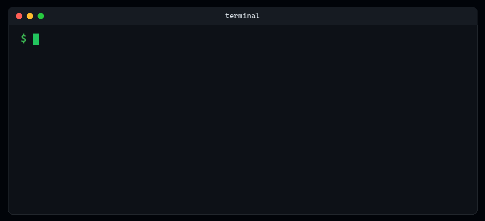
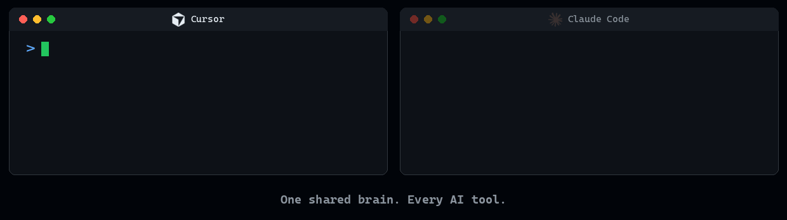
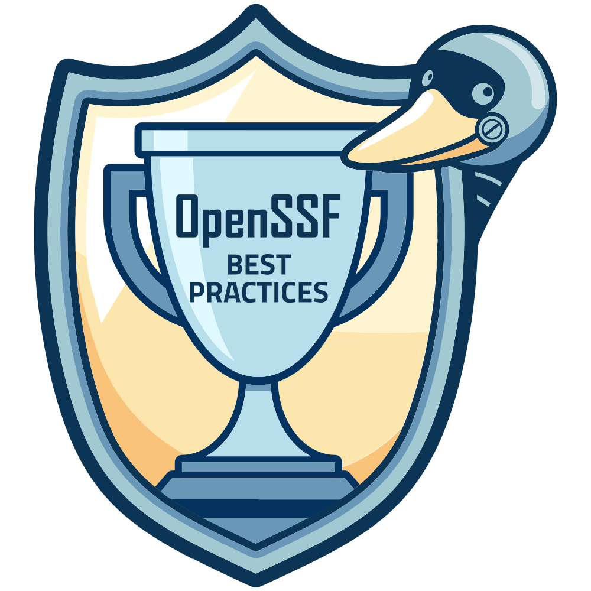

<!-- LANGUAGE-SELECTOR-START -->

🌐 [English](../../README.md) · [العربية](../ar/README.md) · [Deutsch](../de/README.md) · [Español](../es/README.md) · [Français](../fr/README.md) · [हिन्दी](../hi/README.md) · [Italiano](../it/README.md) · [日本語](../ja/README.md) · [한국어](../ko/README.md) · [Português (Brasil)](../pt/README.md) · [Русский](../ru/README.md) · [Türkçe](../tr/README.md) · **简体中文**

<!-- LANGUAGE-SELECTOR-END -->

<div align="center">

</div>

<div align="center">

# EGC - 每个 AI Agent 的共享智脑

**所有 AI Agent、IDE、终端和会话都会自动共享持久记忆。 无需记忆提示词。 无需重新构建上下文。 直接对话即可。**

</div>

---

EGC 并非又一个记忆工具。 它是一个智能中枢，让每个 AI 都能像从项目第一天起就一直参与其中一样工作，适用于 Cursor、Copilot、Claude Code、Codex、Aider 以及任何终端 Agent（共支持 23 种 AI 编程工具）。 原生支持 Claude、GPT-4o、Gemini、DeepSeek、Mistral、Groq、Cohere 和 Vertex AI，还可通过 OpenRouter 接入 Qwen3、Llama 4 等更多模型。

每次对话都在积累项目的集体智慧。 每个 Agent 都能继承这些信息。 每次会话都会变得更智能。

---

## 安装

```bash
npm install -g @egchq/egc && egc install
```

- **至多减少 90%冗余 token，大幅降低成本，确保 AI 在各会话间状态同步。**
- **Guardian 组件：命令执行前主动校验，自动拦截危险写入行为，智能识别提示注入攻击。为每个 Agent 提供安全防护。** 每个共享智能中枢都内置安全防护层。\*\*
- **一键启动，无需配置：记忆仅在本地加密存储，绝不误入 Git 仓库。**

<div align="center">
  
</div>

[完整安装指南](../../docs/installation.md)

---

## 深入智能中枢：EGC 如何运作

EGC 并非工具的简单集合，而是一个具备多种能力的智能中枢。 它能够记忆、理解、保护、过滤和协调，并贯穿你设备上的每个 AI Agent。

<div align="center">
  
</div>

### 无需记忆命令，自然交流即可

你可以使用任何语言与智能中枢对话，例如：“保存本次会话”、“我们之前对身份验证做了什么决定？”或“记住这个决定”。 EGC 能够理解你的意图、保存上下文，并在设备上的任意标签页、终端或工具中立即调用。 一个智能中枢。 每个 Agent。 无需记忆任何命令。

### 项目记忆持久化

EGC 为每个 AI Agent 提供一个持久、共享的智能中枢。 它会记录决策、会话上下文、工作记忆和习得模式，并让这些信息能够立即在你打开的任何其他终端、IDE 或 Agent 中使用。 会话状态、项目历史和积累的经验会在标签页、工具和团队成员之间无缝流转：无需手动同步，也不会丢失上下文。 所有记忆都存储在你设备上的 `~/.egc` 中，使用 AES-256-GCM 加密，按项目分支分别保存，并且绝不会被提交到代码仓库。

### Guardian：内置安全防护组件

智能中枢的另一部分会在后台运行安全防护机制。 它会在命令执行前进行校验，限制高风险写入，在上下文溢出前进行压缩，跨 Agent 编排多步骤任务，并从每次纠正中学习，而无需你主动调用任何工具。 这是一张不可见的安全网，让上下文保持精简、操作保持安全，并让工作流能够自主运行。

### Token 优化器：存储记忆前，自动过滤噪声

这个智能中枢不只是记忆，它还会过滤噪声。 在任何 Shell 输出到达模型之前，EGC 的 Token Crusher 会将 Git 日志、冗余测试输出、安装噪声和巨型 JSON 最多压缩 90%，同时保留每一条错误和警告。 只需用任何语言问一句“我节省了多少？”，答案就会直接从你的本地统计账本中读取，完全零成本：会话更省钱，上下文保留更久。

---

## 提示词库

作为附加内容，EGC 还提供 63 个 Agent、230 项技能、77 条命令以及 111 条规则：其中包括能够自动审查代码的专家、适用于各种语言和场景的最佳实践指南、可一次执行整套任务的快捷方式，以及帮助代码保持一致的风格规则。 所有内容都源自真实的工程实践，而非纸上谈兵。 不想使用这些内容？ 没关系，EGC 的持久记忆功能仍然可以照常工作。

---

## 快速上手

没有第二步。 打开任意一款 AI 工具，直接用任何语言对它说：“你好”、“继续刚才的内容”或“记住这个决定”即可。 会话会立即连接，记忆会自动加载，每个已打开的标签页都能实时了解其他标签页正在做什么：两个 Cursor 标签页、一个 Claude Code 终端和一个 Antigravity 会话可以同时共享同一份动态上下文。

安装完成后，一个实时展示 Agent 活动、Token 使用量和费用的仪表盘会自动启动。 更喜欢手动控制？ 所有命令都记录在[安装指南](../../docs/installation.md)中，不过你可能永远都不需要手动输入它们。

---

🌐 [English](../../README.md) · [العربية](../ar/README.md) · [Deutsch](../de/README.md) · [Español](../es/README.md) · [Français](../fr/README.md) · [हिन्दी](../hi/README.md) · [Italiano](../it/README.md) · [日本語](../ja/README.md) · [한국어](../ko/README.md) · [Português (Brasil)](../pt/README.md) · [Русский](../ru/README.md) · [Türkçe](../tr/README.md) · **简体中文**

---

## 支持 EGC

EGC 是一个由社区成员独立开发，公开维护的开源免费项目。

- **[官网](https://fmarzochi.github.io/EGCSite)**：包含完整文档、功能概览与在线演示
- **[加入 Discord](https://discord.gg/TxppsGb52)**：在这里提问并分享您的反馈意见
- **[在 GitHub 上赞助](https://github.com/sponsors/Fmarzochi)**：金额不限，每一份支持都很重要
- **[通过 PayPal 捐赠](https://www.paypal.com/donate/?business=fmarzochi%40gmail.com&currency_code=USD)**：无需 GitHub 账号
- **点个 Star 关注**：让更多开发者发现此项目
- **[参与贡献](../../.github/CONTRIBUTING.md)**：开发 Agent、技能、命令、修复 Bug 以及完善文档
- **分享**：如果 EGC 改变了你的工作方式，欢迎向他人推荐

### 赞助者

社区支持是维持本项目生命力与独立性的基石。

#### 工具合作伙伴

与 EGC 原生集成的 AI 编程工具。 与 EGC 原生集成的 AI 辅助编程工具。合作伙伴的 Logo 将会在所有项目的 README 文档和 EGCSite 官网上集中展示。

<a href="https://www.pincushion.io/"></a>

#### 年度赞助者 · _虚位以待，期待首个年度赞助_

---

#### 支持者

<a href="https://github.com/chizormaangel-commits"></a> <a href="https://github.com/jackmcwin"></a>

#### 月度赞助者 · _虚位以待_

---

<div align="center">

[](https://www.bestpractices.dev/projects/13099) [](https://www.bestpractices.dev/projects/13099?level=baseline-1) [](https://www.bestpractices.dev/projects/13099?level=baseline-2) [](https://www.bestpractices.dev/projects/13099?level=baseline-3)

<br>

<a href="https://bestpractices.dev/projects/13099"></a>
&emsp;&emsp;&emsp;&emsp;&emsp;&emsp;&emsp; <a href="https://www.linkedin.com/in/felipemarzochi"></a>

</div>
